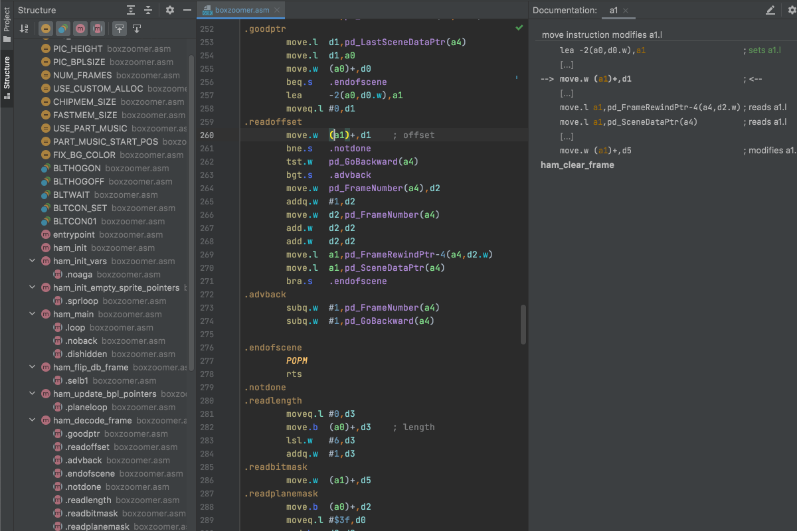

# MC68000 Assembly Language Plugin [](https://app.travis-ci.com/chrisly42/mc68000-asm-plugin) [](https://coveralls.io/github/chrisly42/mc68000-asm-plugin?branch=main)

_MC68000 Assembly Language Plugin_ is plugin for Jetbrains IDEs (CLion, IntelliJ, etc.).



## Purpose

This plugin delivers support for MC680xx assembly language files ([VAsm](http://sun.hasenbraten.de/vasm/) / DevPac-Style).

It adds a language parser with syntax highlighting, referencing and refactoring support, and a few more features.

I'm an Amiga retro democoder (among other things), and the lack of a plugin for M68k was the motivation to write one. Also, diving deep into custom language
plugins has a steep learning curve.

When I started the plugin in July 2021, I was unaware of the [M68k plugin efforts by Jetbrains employee Yann Cébron](https://github.com/YannCebron/m68kplugin)
who has been working on the same topic for quite some time. *On 01-Oct-21, he released
his [first public version](https://plugins.jetbrains.com/plugin/17712-motorola-68000-series-assembler).* Check it out. You can install both plugins at the same
time and see what suits you more.

Big kudos to Yann -- a few features were _inspired_ by his code.

My plugin, on the other hand, is still pretty basic and is the result of a few weeks of work. I released the first versions because I think it's "good enough"
to get started, and I can return to demo coding with its current state.

## Features

- Parser / Lexer for MC680xx assembly language files in VAsm / DevPac style
- Validates the assembly syntax against the 68000/68010 ISA and 68020+ addressing modes (no complete >68020 support yet!)
- Syntax highlighting and Color Settings Page (you should really modify the color settings to your likings!)
- Mnemonics code completion
- Symbols / labels / macros code completion
- References / refactoring support for local and global labels, symbol assignments, and macros.
- Simple register usage flow (hover over register or press F1 for full flow)
- Brace matching
- Quote handler
- Goto Symbol support
- Structure view
- Documentation provider for symbol definitions and mnemonics (listing available addressing modes etc.).

### Inspections

The plugin provides a few inspections for code analysis. An error or warning can be suppressed by placing a `; suppress <InspectionName>` comment either on an
end of line comment behind the statement or in a full line comment above the statement.

#### M68kSyntax - Assembly instruction validity

Checks the validity of the current instruction. If an instruction is not recognized, you may get one of the following errors:

- Instruction _mnemonic_ not supported on selected cpu (you won't get this currently as only MC68000 is supported)
- No operands expected for _mnemonic_
- Second operand _op_ unexpected for _mnemonic_
- Unsupported addressing mode for _mnemonic_
- Unsupported addressing mode _op_ for first operand of _mnemonic_
- Unsupported addressing mode _op_ for second operand of _mnemonic_
- Unsupported addressing modes for operands in this order for _mnemonic_ (try swapping)
- Instruction _mnemonic_ is unsized (you tried to specify `.b`, `.w` or `.l`)
- Operation size _(.b,.w,.l)_ unsupported for _mnemonic_
- Operation size _(.b,.w,.l)_ unsupported (should be _(.b,.w,.l)_)

#### M68kDeadWrite - Dead writes to registers

This inspection looks at register writes and tries to find instructions that renders a write moot because it was overwritten by another instruction before
anything useful was done with it.

Analysis is aborted at global labels, flow control instructions, directives
(e.g. conditional assembly) and macros with the register names as parameter.

The inspection tries to take condition code changing into account and puts out a weak warning if the statement merely changes condition codes before the
contents of the register are overwritten. In this case, it is sometimes better to replace `move` by `tst`.

#### M68kUnexpectedConditionalInstruction - Unaffected condition codes before conditional instruction

Especially for novice coders, it is not clear that some instructions do not affect the condition codes for a subsequent condition branch or `scc` instruction.
`movea`, `adda` and `suba` come to my mind.

The inspection will report such suspicious instruction sequences.

However, this does not need to be a programming error. Advanced coders sometimes make use of the fact that instructions do not change condition codes and thus
optimize the order of execution.

#### M68kUnresolvedReference - Unresolved label/symbol/macro reference

Points out unresolved references such for global and local labels, macros or symbols. Right now, missing symbol and global label references are shown only as
weak warnings as missing macro evaluation will not resolve symbols defined via `STRUCT` macros.

### Documentation provider

#### M68kSymbolDefinition

Provides the assigned value of a `=`, `set` or `equ` symbol definition when hovering over a symbol.

#### M68kMacroDefinition

When used over a macro invocation, shows the expanded macro contents (only the \1 to \9 and \a to \z are expanded according to the parameters used).

#### M68kLabelDefinition

Shows the comments above the label (local or global) and an end-of-line comment, if available. If the first statement after the label is a directive
like `include` or `dc.b`, it will be shown, too.

#### M68kRegisterFlow

When hovering over or placing the cursor at a data or address register, the documentation will scan through the instructions backwards and forwards and will
show all read, changes of the register contents. It does this until an instruction is found that defines (sets) the contents of the register
(according to the size of the instruction where the cursor was placed).

The analysis ignores all code flow instructions and might be inaccurate for branches, macro use, etc. It also stops at global labels.

The documentation will search up to 100 instructions in each direction, but only four when hovering over the register
(so if you need the whole analysis, use the documentation window).

#### M68kInstruction

When hovering over a mnemonic, it will show a short description of the assembly instruction.

For the documentation window, affected condition codes, allowed operation sizes and addressing modes are listed for the selected instruction
(so only stuff from `cmpa` is listed when you're looking at a `cmp.w a0,a1` instruction).

If the current statement has no valid syntax, the instruction details of all matching mnemonics will be shown instead.

## Known issues

- `Find Usages` always shows _"Unclassified"_ though it shouldn't (?)
- `END` detection was breaking parsing, so this is disabled for now until I find a working solution.
- Macro invocations are not yet evaluated, thus no referencing to symbols defined via macros (e.g. `STRUCT`).
- Scoping for global symbols, labels and macros is currently the whole project.
- No support for register replacement (e.g. registers replaced by `EQUR` or `EQURL` will cause syntax errors)
- No support for other processor instructions and FPU. Yet.
- The pretty esoteric use of `ZPC`, `ZA0-ZA7` or `ZSP` for zero (omitted) address in 68020 addressing modes is unsupported.
- Devpac allowed shuffling of (base) displacement and other parameters inside the new syntax (68020+) brackets. Well, I don't. Only strict `(bd,An,Xn*s)` or
  `([bd,An],Xn*s,od)` order allowed.
- Switching the spaces option usually needs the caches to be invalidated. Find Usages word scanner always uses default settings, as it is not configurable per
  project :-/
- Unit Test coverage is not as good as it could be (ahem).
- Code flow sometimes outputs "uhm?"
- Missing but planned features:
    - Macro evaluation on invocation
    - Folding
    - More semantic inspections
    - Quick fixes
    - Maybe formatter + Code Style Settings
    - Register use analysis (but this only makes sense after macro evaluation)
    - Cycle counting

## Recommendations

Currently, I would suggest using the fabulous [Browse Word at Caret Plugin](https://plugins.jetbrains.com/plugin/201-browsewordatcaret)
to highlight the same address and data registers while editing (see new `View -> Highlight Word at Caret` menu item).

## Development notice

This plugin has been written in Kotlin 1.7 using Grammar-Kit.

It is probably the only plugin (besides [Cajon](https://github.com/chrisly42/cajon-plugin) from the same author) that uses JUnit 5 Jupiter for unit testing so
far (or at least the only one I'm aware of ;) ). The IntelliJ framework actually uses the JUnit 3 TestCase for plugin testing, and it took me quite a while to
make it work with JUnit 5. Feel free to use the code (in package ```de.platon42.intellij.jupiter```) for your projects (with attribution).

## Feedback

I guess there are currently over 500 users of this plugin and while I wrote this mainly for myself, I'm only doing this in my spare time.

Feedback and [rating](https://plugins.jetbrains.com/plugin/17268-mc68000-assembly-language-support/reviews)
are appreciated. It really is keeping me motivated to continue development.

## Changelog

### V0.10 (20-Feb-24)

- Decided to release some features that have been sitting on my harddrive for almost two years, but never got released,
  because I was unable to get that damn formatter working in a way that was acceptable (the API and the docs are easily one
  the worst abominations I've come across).
- Maintenance. Updated all dependencies to the latest versions.
- New: Added semantic highlighting. Currently available for data and address registers and local labels.
- Bugfix: addq/subq for address register stated it would affect the condition codes, which it in fact doesn't.
- New: Added simple custom navigation bar.
- New: Added folding support for functions and macro definitions.
- New: Added assembler directives to code completion (only lower-case except for other directives like IF
  and MACRO, which are only suggested for upper-case).

### V0.9 (16-Aug-22)

- Maintenance. Updated all dependencies to the latest versions.
- Bugfix: Fixed condition code for `asr/lsr/lsl`, which is has a different behaviour for V flag than `asl`.
- Bugfix: Fixed 'Unknown op size' exception when uppercase sizes were used.
- Bugfix: Refactoring was broken for newer IDE versions, at least for me, this now works again by unknown magic.

### V0.8 (15-Oct-21)

- New: Support for MC68020+ addressing modes! However, MC68020+ specific instructions have not been added yet.
- New: Full support for MC68010 ISA (`movec`, `moves` and new special registers `SFC` and `DFC`).
- Enhancement: Label documentation now also works for local labels and includes end-of-line comment for label, too.
- Enhancement: Symbol definition documentation now also includes comments in the same way as the label documentation does.
- New: Macro definition / invocation documentation provider that even tries to expand macros.
- New: Added Language settings page with one option so far (-spaces option).
- New: Added some more settings for maximum parsed lines inside a macro and maximum displayed lines of code for documentation.

### V0.7 (26-Sep-21)

- Bugfix: `btst` with pc-relative and weird immediate mode was missing (courtesy of Yann).
- Bugfix: `movem` with pc-relative mode was missing for weird immediate mode (courtesy of Yann).
- Bugfix: Special registers for address mode matching only worked with lower case register names (courtesy of Yann).
- Enhancement: Assembler syntax with implicit immediate 1 for shifts and rotations no longer cause syntax errors (courtesy of Yann).
- Enhancement: Documentation for instruction with special register shows specific register expected.
- New: Added documentation provider info for global labels. Shows directives and comments above.
- Bugfix: Fixed BNF for labels with preprocessor statements.
- Disabled: `END` detection was breaking parsing, causing havoc.

### V0.6 (09-Aug-21)

- Enhancement: `opt` and several other directives (`printt`, `fail` etc.) no longer causes a syntax error when unquoted.
- Enhancement: `include`, `incdir` and `incbin` and `output` with `<pathname>` quotes no longer cause syntax error.
- New: Files in `include` directives can be referenced and renamed/refactored.
- New: Code completion for local label definitions, suggesting undefined labels already referenced.
- New: Added inspection suppression possibility and quickfix.
- New: Added inspection for unresolved symbols, macros and labels.
- Enhancement: 'END' directive stops parsing.

### V0.5 (06-Aug-21)

- Bugfix: `movem` ISA was wrong regarding the `movem.w <ea>,<registerlist>` (sign extends registers).
- Cosmetics: Changed Register Flow Documentation wording from _reads_ to _uses_ and from _modifies_ to _changes_.
- Bugfix: Minor fix for `andi/eori/ori to ccr` which were not byte sized in ISA.
- Bugfix: Added alternate condition code tests `HS (=CC)` and `LO (=CS)`.
- Performance: Optimized mnemonic lookup.
- Enhancement: Reworked Instruction Documentation provider, now shows condition codes.
- Bugfix: In ISA `exg` is no longer treated as setting a definitive value.
- New: Added inspection to find dead writes to registers!
- New: Added inspection to warn about unexpected condition code unaffecting instructions before conditional instructions.

### V0.4 (03-Aug-21)

- Notice: Due to major new API use, this plugin no longer works on IDEs >=2019.3.1, but rather requires >=2020.3.
- Enhancement: Added Structure View filters.
- New: Added inspection to validate the correctness of a MC68000 instruction regarding operation size and address modes.
- Bugfix: Added several missing assembler directives (`opt`, `machine`, etc.).
- Bugfix: Uppercase hexadecimal literals were not parsed (JFlex bug?).
- Bugfix: Interpretation of register lists was wrong in BNF.
- New: Added Documentation Provider for symbol definitions (shows assigned declaration).
- New: Added Documentation Provider for mnemonics (simple version, generated out of ISA information).
- Bugfix: Macro definitions with colons and without space supported (as found in P61a source).
- New: When asking for documentation on registers, a code flow analysis is done. Cool stuff!

### V0.3 (28-Jul-21)

- Enhancement: Macro contents are no longer parsed, added syntax highlighting options for macros.
- Enhancement: Macro definitions are now word and stub indexed, macro calls reference to definition.
- New: Macro definition refactoring and find usages support.
- Enhancement: Structural View also shows macro definitions.
- Bugfix: Missing `REPT` and `ENDR` assembler directives added.
- Cosmetics: Changed or added some icons at various places.
- Performance: Reference search for global labels and symbols now uses stub index.
- Compatibility: Restored compatibility with IDE versions < 2021.1.
- Performance: Optimized lexer.

### V0.2 (27-Jul-21)

- Cosmetics: Added (same) icon for plugin as for file type.
- Performance: Use Word-Index for global labels and symbols instead of iterating over the file.
- Performance: Use Stub-Index for global labels and symbols.
- Bugfix: No longer reports a syntax error when file lacks terminating End-Of-Line.
- Enhancement: Registers are now offered for code completion, making editing less annoying.

### V0.1 (20-Jul-21)

- Initial public release.
